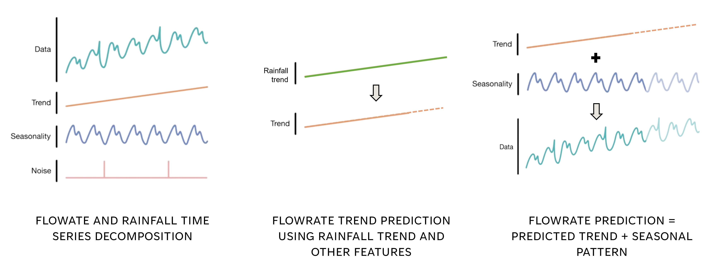

# Repository description
In this repository, you will find the final research project report (see [report.pdf](report.pdf)) and two types of files:
- **dataset files**, listed in folders whose names contain "data", followed by the source of the data
- **code notebooks**, in .ipynb format

## Datasets
The datasets contain:
- `data_mrc`: flowrate daily data for Stung Treng (1910-2024), Kratie (1924-2024), and Chiang Khan (1967-2024) (source: Mekong River Commission data portal)
- `data_mrc`: rainfall daily data for Stung Treng (2007-2024) and Chiang Khan (2008-2024) (source: Mekong River Commission data portal)
- `data_imf`: GDP annual data and forecasts for Thailand and Laos (1980-2029) (source: IMF)
- `data_iea`: annual hydro and solar generation in Laos and Cambodia (2005-2021) (source: IEA)
- `temp_cambodia` & `temp_month_cambodia`: Cambodia annual mean temperature (2007-2022) and monthly mean temperatures averaged by decade (1051-2020) (source: [Climate change knowledge portal](https://climateknowledgeportal.worldbank.org/country/cambodia/trends-variability-historical))
- `data_fao`: annual rice production in Cambodia and Laos (2005-2022) (source: FAO)

## Code files inventory

The details of the code files are the following:
- `stats.ipynb`: data analysis and stats based on Stung Treng data
- `linreg.ipynb`: first tests with linear regressors comparing the implementation of rainfall and flowrate features and polynomial transformation
- `linreg_advanced.ipynb`: thorough feature selection on classic Scikit-learn linear regression model, using flowrate and rainfall lag features and GDP data
- `decisiontree.ipynb`: same as above but with the Scikit-learn decision tree regressor
- `monthly_linreg.ipynb`: linear regression models based on monthly Stung Treng datasets using all rainfall and flowrate features
- `quantile_reg.ipynb`: quantile regression for low flowrates based on Stung Treng and Chiang Khan datasets
- `trend_models.ipynb`: linear regression models based on the time series decomposition of Stung Treng data, followed by the forecast of flowrate trend, before recombining it with the extracted seasonal pattern (more details in section [Models based on time series decomposition](#models-based-on-time-series-decomposition))
- `nested_crossval.ipynb`: nested cross-validation based on Stung Treng dataset
- `nested_cv_nobaseline.ipynb`: nest cross-validation based on Stung Treng dataset without the monthly minimum flowrate feature
- `nested_cv_CK.ipynb`: nested cross-validation based on Chiang Khan dataset
- `kratie_pred.ipynb`: models predicting Kratie flowrate based on Stung Treng inputs
- `pred_COVID.ipynb`: models predicting 2020-2021 flowrate based on Stung Treng dataset
- `st_with_ck_models.ipynb`: models trained on Chiang Khan dataset and tested on Stung Treng dataset
- `ck_with_st_models.ipynb`: models trained on Stung Treng dataset and tested on Chiang Khan dataset
- `LSTM_models.ipynb`: first draft of LSTM models to forecast flowrate based on Stung Trend dataset (unfinished work)

## Models based on time series decomposition

